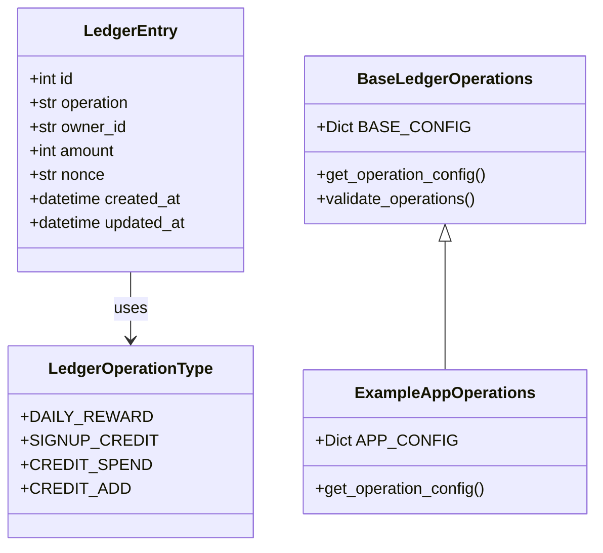
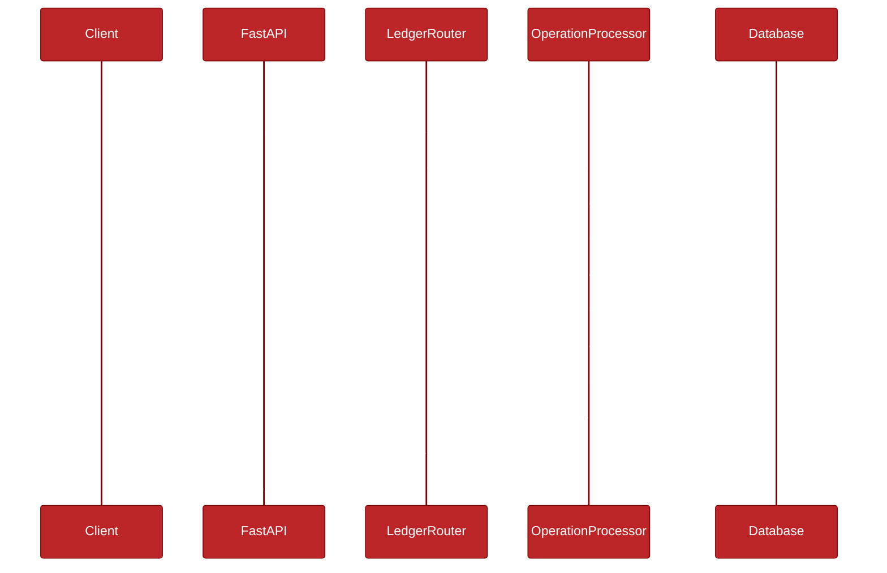
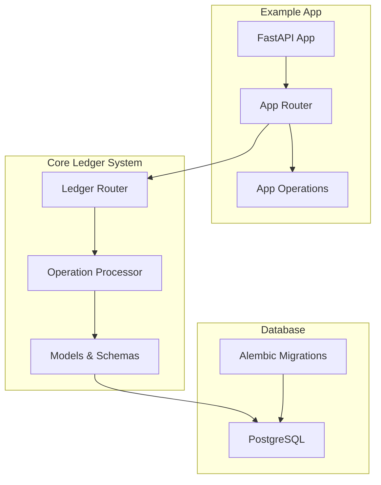
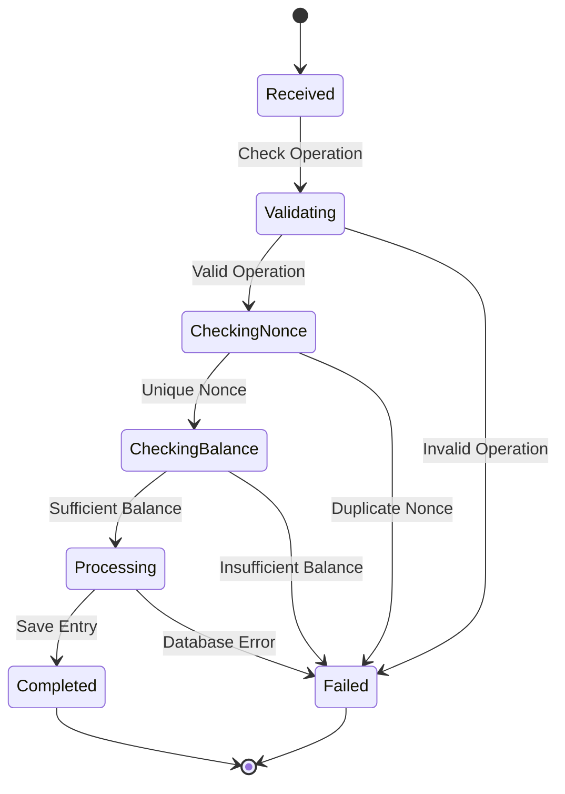

# System Architecture

This document provides a detailed view of the Shared Ledger System's architecture using various diagrams.

## Core Models

The following class diagram shows the main components of the ledger system and their relationships:

## Operation Flow

This sequence diagram illustrates the flow of a ledger operation from request to response:

## System Components

The component diagram below shows how different parts of the system interact:

## Transaction States

The state diagram shows the lifecycle of a ledger transaction:

## Key Design Decisions

1. **Modular Architecture**
   - Core ledger functionality is separated from application-specific code
   - Applications can extend base operations while maintaining type safety
   - Shared database models and schemas ensure consistency

2. **Transaction Safety**
   - Nonce-based duplicate prevention
   - Balance checks before processing
   - Atomic database operations
   - Comprehensive error handling

3. **Scalability**
   - Asynchronous operations throughout
   - Efficient database queries
   - Connection pooling
   - Modular design for easy extension

4. **Developer Experience**
   - Clear separation of concerns
   - Type-safe operations
   - Comprehensive testing
   - Detailed documentation
   - Docker-based development environment 